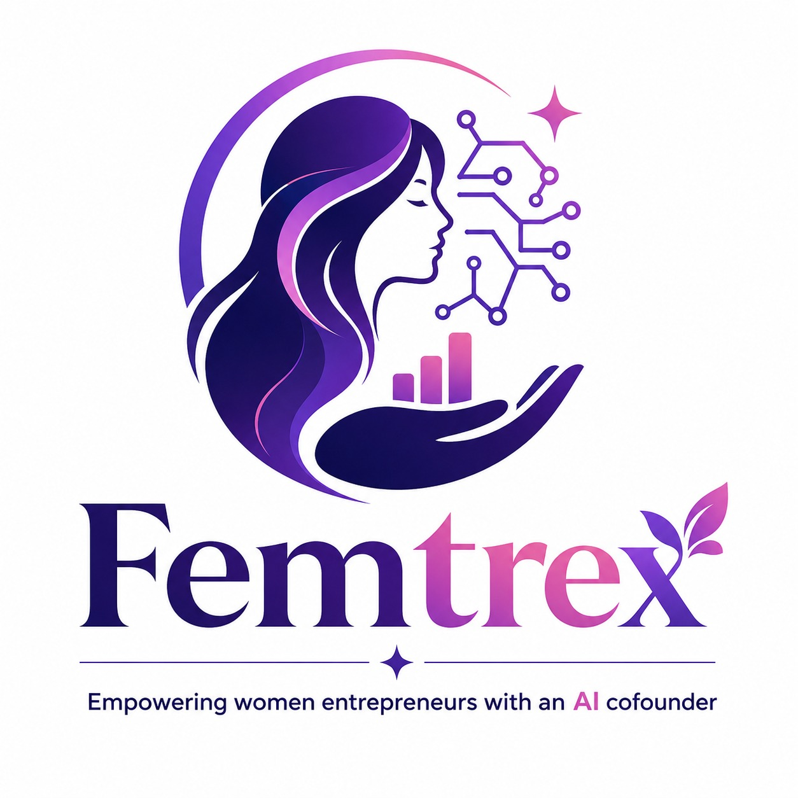

<div align="center">



#  Femtrex

### Empowering Women Entrepreneurs with an AI Co-Founder

An AI-powered Founder Operating System that helps first-time women entrepreneurs navigate funding opportunities, build business credibility, connect with the right mentors, and grow confidently through intelligent, personalized guidance.

---

### 🚀 Girls Hack Day Delhi 2026 Hackathon Project

*"From Idea to Impact — Your AI Co-Founder at Every Step."*

</div>

---

> ## ⚠️ Prototype Status
>
> This repository contains the **Stage 1 prototype** of **Femtrex** developed for **Girls Hack Day Delhi 2026**.
>
> The current version showcases the complete product vision, UI foundation, application architecture, and core feature workflows. AI integrations, backend services, and production-ready implementations are actively under development.

---

# 🌍 The Problem

Every year, thousands of women launch businesses with innovative ideas—but many never reach their full potential due to fragmented support systems.

Entrepreneurs often struggle with:

- Finding relevant government schemes and funding opportunities
- Understanding complex eligibility criteria
- Building trust with lenders and investors
- Finding the right mentors instead of generic networking
- Receiving personalized business guidance during critical decisions

Today's ecosystem is fragmented across multiple portals, making entrepreneurship unnecessarily difficult.

---

# 💡 Our Solution

## Meet **Femtrex**

Femtrex is an **AI-powered Founder Operating System** designed exclusively for women entrepreneurs.

Rather than being another information portal, Femtrex acts as a trusted digital co-founder that understands a founder's business, identifies opportunities, builds credibility, recommends the right mentors, and provides intelligent guidance throughout the entrepreneurial journey.

---

# ✨ Core Features

## 🧠 AI Scheme Matcher

Discover government schemes, grants, subsidies, and startup opportunities tailored specifically to your business.

### Highlights

- AI-powered eligibility matching
- Personalized scheme recommendations
- Smart document checklist
- Application guidance
- Real-time opportunity discovery

---

## 🛡 Business Credibility Passport

A verified digital business identity that strengthens trust with lenders, investors, accelerators, and mentors.

### Includes

- Business profile verification
- AI-generated credibility insights
- Startup readiness indicators
- Growth recommendations
- Business trust score

---

## 🤝 Micro-SLA Mentorship

Instead of vague mentorship requests, Femtrex enables focused **15-minute outcome-driven mentorship sessions**.

Example:

✅ "Review my investor pitch."

✅ "Validate my pricing strategy."

✅ "Help improve my business model."

Every session solves one specific challenge, resulting in measurable business outcomes.

---

## 🎯 AI Mentor Matching Engine

Finding the right mentor is often harder than finding a mentor.

Femtrex intelligently recommends mentors based on:

- Startup stage
- Industry
- Business domain
- Current challenges
- Funding goals
- Required expertise

This ensures every entrepreneur connects with mentors who truly understand their business journey.

---

## 🤖 AI Founder Copilot

Your intelligent business companion throughout the entrepreneurial journey.

The AI Co-Founder assists with:

- Business planning
- Funding guidance
- Scheme recommendations
- Documentation support
- Startup roadmap
- Growth insights
- Business Q&A

---

# 🏗 Product Workflow

```text
Women Entrepreneur
        │
        ▼
Business Onboarding
        │
        ▼
AI Business Understanding
        │
        ▼
Business Credibility Passport
        │
        ▼
AI Scheme Matcher
        │
        ▼
AI Mentor Matching Engine
        │
        ▼
Micro-SLA Mentorship
        │
        ▼
AI Founder Copilot
        │
        ▼
Growth Dashboard
```

---
